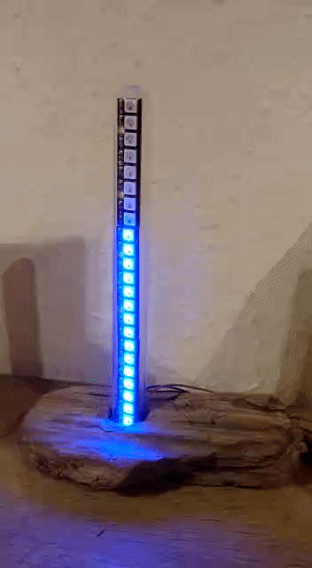

# Arduino Tide Visualization

This sketch pulls tidal data from a German weather station and shows
it on AdaFruit NeoPixels. The data is obtained every 30 seconds and
the update is indicated by an animation (that also shows the current
trend - rising or falling).

See www.pegelonline.wsv.de for more information on available tidal
data.

Circuit:
* Arduino MKR 1000
* 3 Adafruit NeoPixel Sticks connected to GND, 5V, and PIN 7

